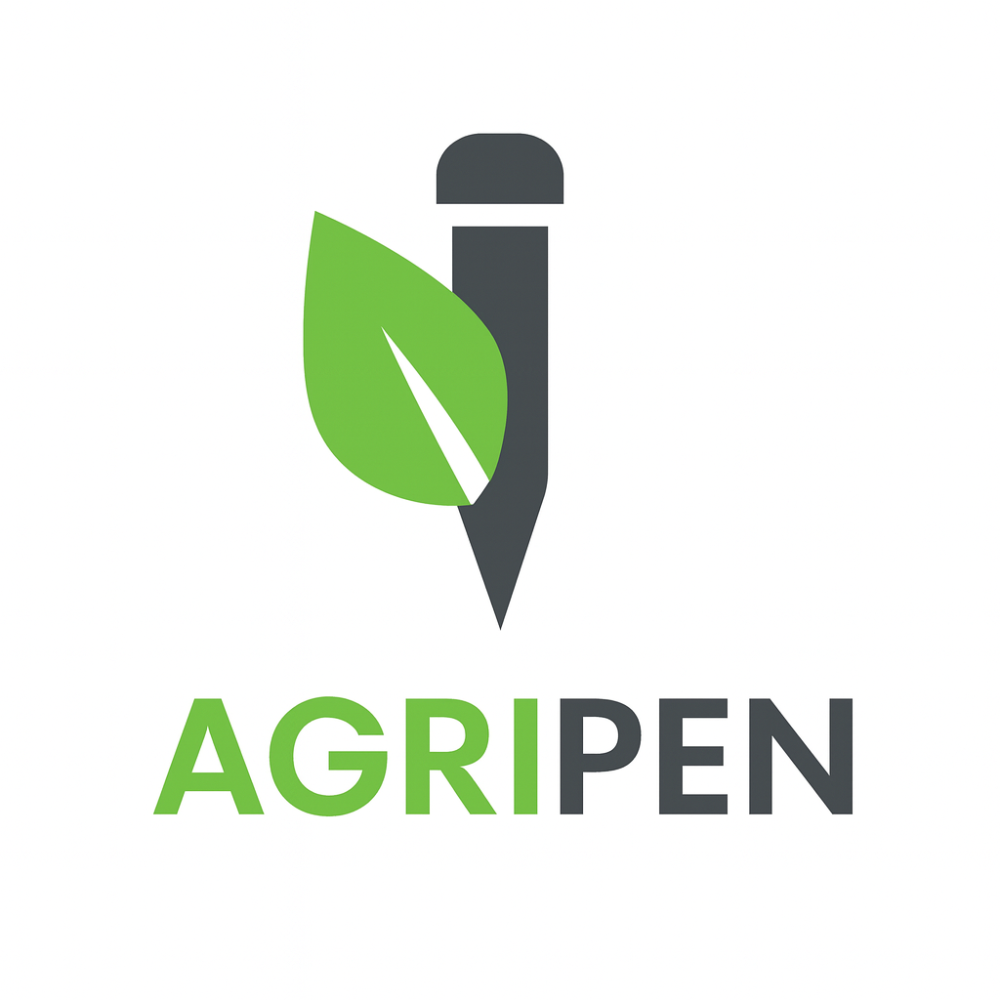
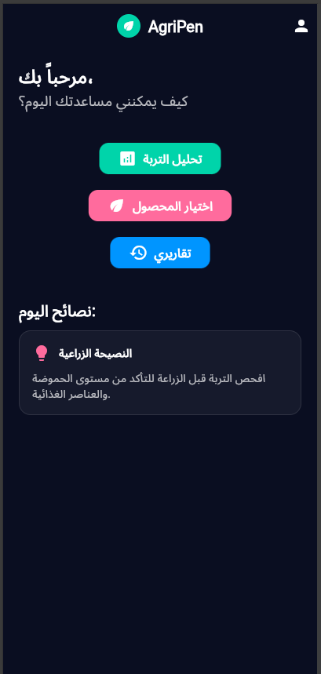
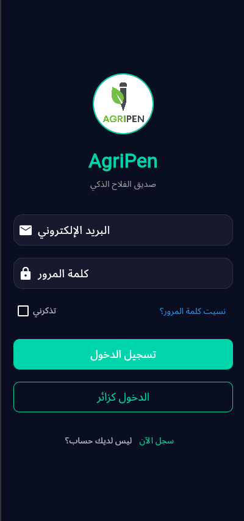
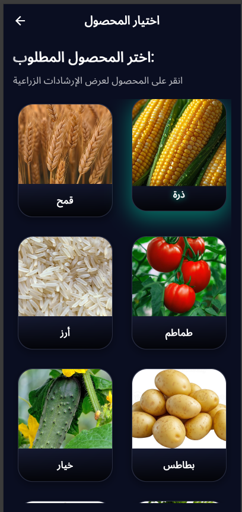
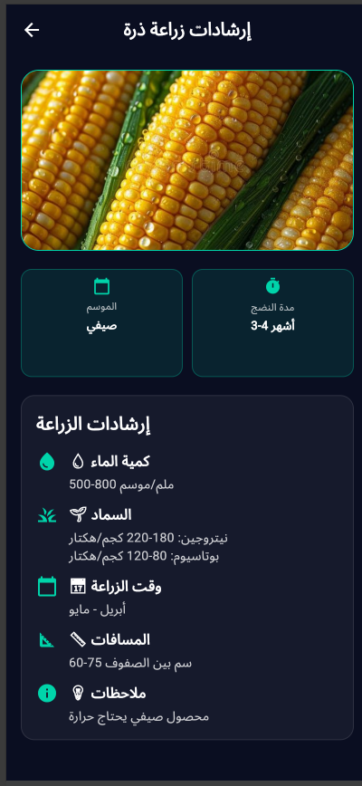
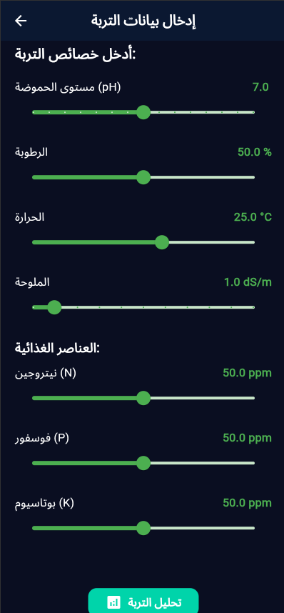
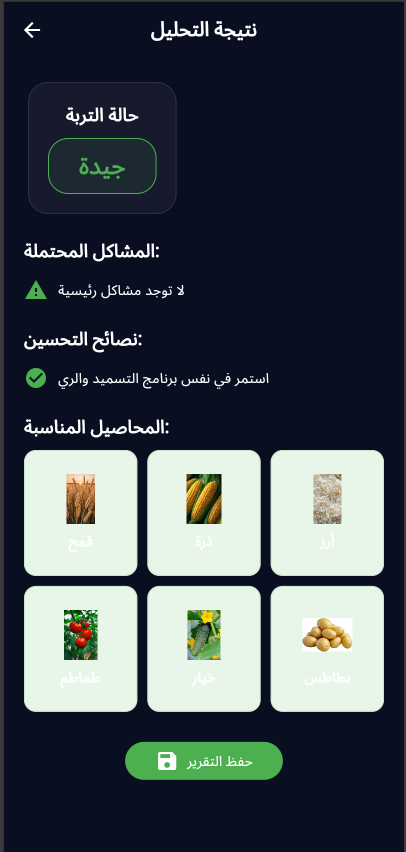
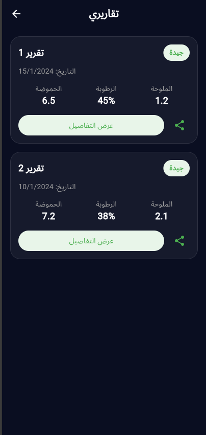
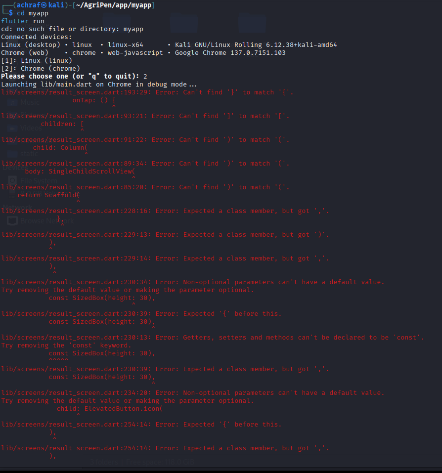
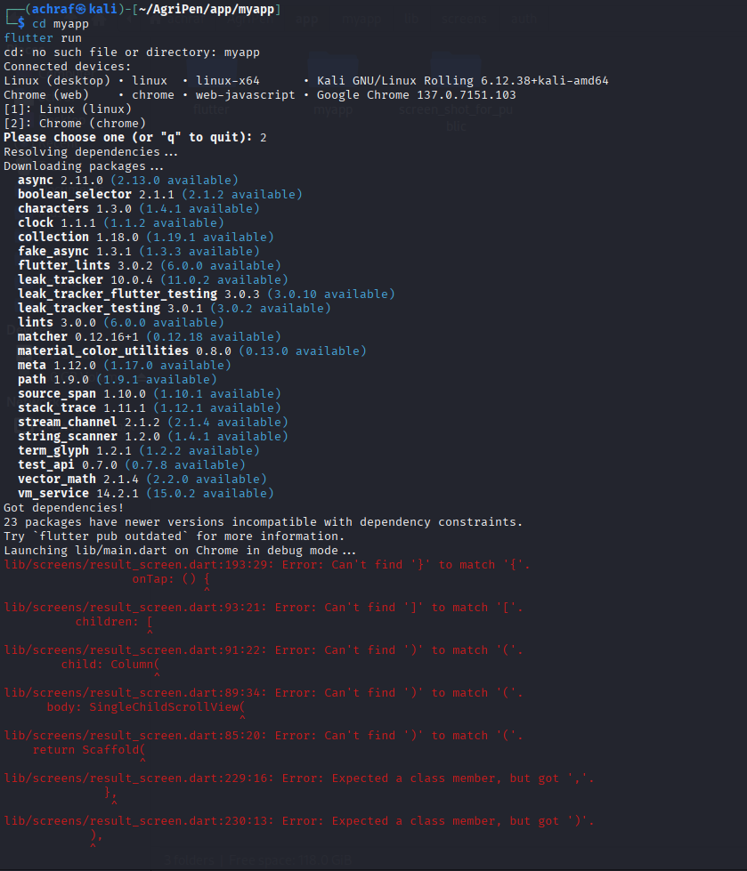

  

# 📱 AgriPen – Beta Version

AgriPen is the first experimental release of our smart agricultural assistant, designed to support farmers and growers through intelligent soil analysis and modern digital tools.
This Beta version represents the first step towards a fully integrated AI-powered agricultural platform.

---

## 🎯 What This Beta Version Offers
### ✅ Currently Available Features (MVP)

1️⃣ **Smart Soil Analysis**  
- Input essential soil properties (pH, moisture, temperature, salinity, NPK).  
- Receive an instant evaluation of soil quality.  
- Get simple improvement suggestions based on experimental rules and early datasets.

2️⃣ **Crop Recommendation System**  
- Browse a gallery of available crops.  
- For each crop: short information, planting conditions, watering schedule, and required environment.

3️⃣ **Reports System**  
- Save all analysis results locally on the device.  
- Each report is displayed as a card with detailed information available on tap.

4️⃣ **Modern Dark Mode UI**  
- Clean, minimalist, and modern interface.  
- Smooth navigation and comfortable user experience.

---

## 🔄 Upcoming Features (Coming Soon)
- 🟦 Real Database Integration  
- 🟩 Full User Account System  
- 🟨 Cloud Synchronization  
- 🟧 Agricultural Mapping (Geo-Mapping)  
- 🟥 Smart Alerts System

---

## ⚠️ Important Notes for the Beta Version
- 🔹 Experimental Data: All analysis results rely on early experimental formulas and non-final datasets.  
- 🔹 Local-Only Data Storage: All user data is stored locally on the device during this Beta stage.  
- 🔹 Guest Mode Available: The app is fully usable without creating an account.  
- 🔹 User Feedback Welcome: Your feedback is essential to improve the final version.

---

## 🚀 AgriPen Future Vision
- 🌱 Advanced Soil Analysis  
- 🤖 AI-Driven Recommendations  
- 🚜 Smart Farm Management System  
- 🌐 IoT Integration  
- 🗺️ Advanced Mapping & Large Area Analysis

---

## 🖼 Screenshots

  
  
  

  
  
  

  
  
  

